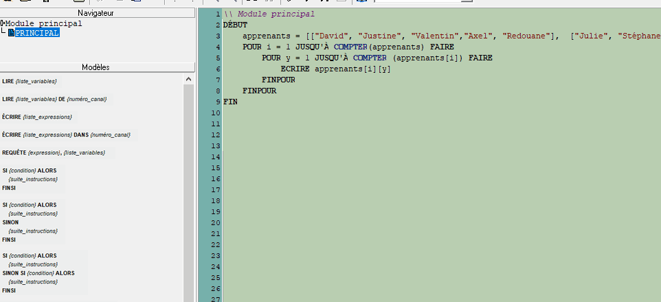

1. [Introduction](../README.md)
1. [Les variables](./variables.md)
1. [Les conditions](./conditions.md)
1. [Les boucles](./whileAndFor.md)  
1. [Les tableaux](./array.md) 
1. [Les fonctions](./function.md) ←
    
# Les fonctions

Les fonctions sont des "bout de code" qui contiennent une suite d'instructions, boucles, conditions, etc ... On fait appel à ces fonctions en l'écrivant comme ceci ``FONCTION()``. 

## Les fonctions prédéfinies

Il existe déjà des fonctions toutes faites au sein de LARP. Une de ces fonctions aurait pu vous aider pour les exos précédents. Par exemple la function MAX() analyse le tableau et retourne le nombre le plus haut. 

````
DEBUT
    nombres = [2,98,-5,48,55]
    ECRIRE MAX(nombres)
FIN
```` 
Ce bout de code va retourner le nombre 98. Il existe la fonction inverse qui elle retournera le nombre le plus petit. 
````
DEBUT
    nombres = [2,98,-5,48,55]
    ECRIRE MIN(nombres)
FIN
```` 
Retournera le nombre -5. 

Une autre fonction qui est bien pratique c'est la fonction ``COMPTER()`` . Cette fonction va retourner le nombre d'élément que contient le tableau. Exemple. 

````
DEBUT
    apprenants = ["David", "Justine", "Valentin","Axel", "Redouane"]
    ECRIRE COMPTER(apprenants)
FIN

````
Retournera 5. Cette fonction aurait été prtaique pour faire les boucles du précédent chapitre. 
````
\\ Module principal
DÉBUT
    apprenants = [["David", "Justine", "Valentin","Axel", "Redouane"],  ["Julie", "Stéphane", "Mostapha", "Claudiu", "Son"]]
    POUR i = 1 JUSQU'À COMPTER(apprenants) FAIRE
        POUR y = 1 JUSQU'À COMPTER (apprenants[i]) FAIRE
            ECRIRE apprenants[i][y] 
        FINPOUR 
    FINPOUR
FIN   
````

Vous vous souvenez ? Dans l'exemple se trouvant dans le précédent chapitre, on était obligé de mettre le nombre d'étudiant en dur dans la boucle. 

````
\\ Module principal
DÉBUT
    apprenants = [["David", "Justine", "Valentin","Axel", "Redouane"], ["Julie", "Stéphane", "Mostapha", "Claudiu", "Son"]]
  
    POUR i = 1 JUSQU'À **2** FAIRE
        POUR y = 1 JUSQU'À **5** FAIRE
            ECRIRE apprenants[i][y] 
        FINPOUR 
    FINPOUR
FIN  
````
C'était pas très pratique, imaginez qu'un des deux tableaux ait 4 apprenants et l'autre 5 apprenants. Il y aurait eu erreur de LARP car il n'aurait pas trouvé le 5e apprenant.  

Essayez ce code, ici on a retiré "Julie" de la classe Lovelace. Vous allez avoir une erreur de compilation.

````
\\ Module principal
DÉBUT
    apprenants = [["David", "Justine", "Valentin","Axel", "Redouane"], ["Stéphane", "Mostapha", "Claudiu", "Son"]]
  
    POUR i = 1 JUSQU'À **2** FAIRE
        POUR y = 1 JUSQU'À **5** FAIRE
            ECRIRE apprenants[i][y] 
        FINPOUR 
    FINPOUR
FIN  
````

La fonction ``COMPTER()`` résoud ce problème. 

Petite info supplémentaire, quand on mets la variable ``apprenants`` entre les paranthèses ``COMPTER(apprenants)``, on dit qu'on passe la variable en **argument** 


## Les fonctions personalisées 

Il est possible de créer ses propres fonctions. Pour l'exemple on va créer une fonction ``ADDITION`` qui retrournera la somme des deux variables passé en argmuent. 

Pour commencer, allez dans la fenêtre de gauche et faites un click droit sur ``PRINCIPAL``, ensuite sélectionner ``Nouveau module (pseudocode)``



Dans le nouveau module, on va lui indiquer que l'on peut recevoir 2 arguments. 
````
\\ Module auxiliaire ADDITION
ENTRER  a, b
````
Cela veut dire que l'on pourra passer deux arguments en écrivant  ``ADDITION(a,b)``.
Ensuite nous devons lui dire que la variable ``somme`` sera la valeur de a + b. 

````
\\ Module auxiliaire ADDITION
ENTRER  a, b
    somme = a + b
````

Enfin, nous devons définir ce qui sera retourné par la fonction, dans ce cas ci la somme de l'adition donc. 

````
\\ Module auxiliaire ADDITION
ENTRER  a, b
    somme = a + b
RETOURNER somme
````

Vous pouvez maitenant retourner dans le module principal.
Appelez votre fonction en écrivant ``ADDITION(4,8)``
(Ou n'importe quel nombre) 

````
\\ Module principal
DÉBUT
   ECRIRE ADDITION(5,6)
FIN 
```` 
Le résultat sera 11. 
Eh bien bravo, tu viens de créer ta première fonction. 
      


