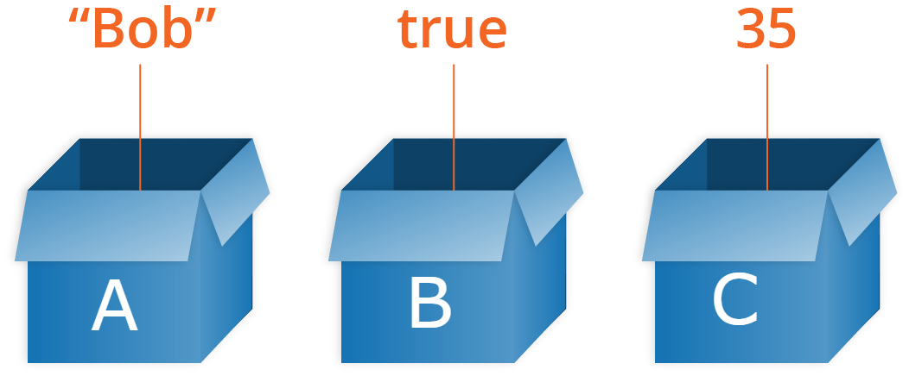
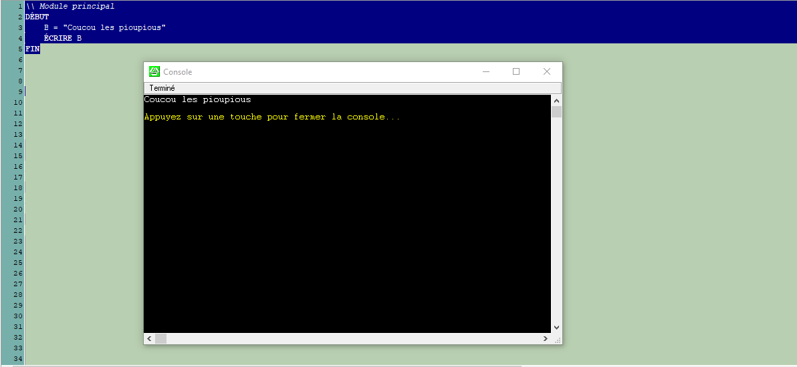

# Les variables 

Les variables permettent de stocker **temporairement**  une **valeur** dans la mémoire de l'ordinateur. On pourra ensuite s'en servir et l'utiliser au moment venu dans un programme. On peut comparer cela à une petite boite dans laquelle on pourrait stocker une information ou plusieurs informations. 

Il existe plusieurs types de variables, certaines peuvent contenir des nombres entier, d'autres des nombres à virgule ou une chaîne de caractère. Un autre type qui est très pratique, ce sont les booléens. Une variable booléene ne peut contenir que 2 valeurs, soit ``False`` soit ``True``.  Il existe d'autres types, mais nous verrons cela plus tard.



## Déclaration et affectation des variables
Ici le nom de la variable est A et sa valeur est en entier (2).
````
\\ Module principal
DÉBUT
    A = 2
FIN
````

Le nom de la variable est toujours A mais cette fois elle contient une chaîne de caractère aussi appellé String. Les chaînes de caractère commencent toujours par des guillemets.
````
\\ Module principal
DÉBUT
    A = "Ceci est une chaîne de caractère"
FIN
````

**Attention donc, dans l'exemple suivant, il s'agit non pas d'un entier mais d'une chaîne de caractère.** 
````
\\ Module principal
DÉBUT
    A = "2"
FIN
````

## Les opérateurs
Les opérateurs permettent de diviser, multiplier, additionner, etc .. 

On  peut par exemple additionner les variables, mais il faut qu'elles soient du même type.
````
\\ Module principal
DÉBUT
    A = 4
    B = 6
    A + B  // retournera 10
FIN
````
Par contre on ne peut pas additionner une chaîne de caractère et un nombre entier. Ceci provoquerait une erreur.

````
\\ Module principal
DÉBUT
    A = "Hello"
    B = 4 
    A + B // retournera une erreur car le compilateur ne comprend pas ce qu'il doit additionner
FIN
````
 
Par contre, on peut additionner deux chaines de caractère

````
\\ Module principal
DÉBUT
   
    A = "Coucou les pioupious"
    B = "de turing"

    A + B  \\ Va retourner "Coucou les pioupiousde turing"
FIN
````

L'addition retournera bien les deux chaînes de caractère collées. Pour mettre un espase entre les deux chaînes de caractère, on peut faire ceci : 

````
\\ Module principal
DÉBUT
    B + " " + D \\ Retournera : "Coucou les pioupious de turing"
FIN
````
Notez au passage qu'on appelle cela "concatener".


## Lire et écrire les variables
Jusqu'à présent, on affiche pas les variables qu'on utilise dans la console.Donc pour l'instant, nos variables ne servent à rien.  
On va  régler le problème en utilisant une fonction qui nous pertmettra d'écrire les variables dans la console.  
````
\\ Module principal
DÉBUT
    B = "Coucou les pioupious"
    ÉCRIRE B
FIN
````
Appuyez sur ``F7`` ou sur le petit bouton ``Exécuter`` (petit bouton play) dans LARP. Vous devriez voir quelque chose comme ceci : 




Avec la fonction ``LIRE``, on a la possibilité de capturer ce que l'utilisateur encode dans la console.   
Essaiez ceci : 

````
\\ Module principal
DÉBUT
    A = "Quel est ton prénom ?"

    ÉCRIRE A
    LIRE RESPONS

    B = "Bonjour "
    ÉCRIRE B + RESPONS   

FIN
````

Allez à vous de jouer.

## Exercices


### 1. Que retournera ceci ?
````
\\ Module principal
DÉBUT
    A = "8"
    B = "7"
    ÉCRIRE A + B
FIN
````
<details>
    <summary>Solution </summary>
    "87"
</details>

### 2. Et ceci ?
````
\\ Module principal
DÉBUT
    A = 8
    B = "7"
    ÉCRIRE A + B
FIN
````
<details>
    <summary>Solution </summary>
 
La réponse est **15**  
Dans un cas comme celui-là, le compilateur comprend qu'il doit interpréter ``B`` comme un nombre entier. Cela dit, on évite absoluement ce genre de chose. D'une part ça ne fonctionnera pas dans tous les langages et d'autres part, ça peut porter à confusion et générer des erreurs ou des résultats inattendus.
</details>


### 3. Créer un phrase avec les mots ci dessous

````
\\ Module principal
DÉBUT
    A = "à"
    B = "J'"
    C = "coder"
    D = "apprends"
FIN
````

<details>
    <summary>Solution</summary>

````
\\ Module principal
DÉBUT
    A = "à"
    B = "J'"
    C = "coder"
    D = "apprends"

    ÉCRIRE B + " " + D + " " + A + " " + C
FIN
````
</details>

### 4 . Inverse les valeurs de deux variables.
```
\\ Module principal
DÉBUT
    A = 7
    B = 12 
FIN
```

<details> 
  <summary>Solution </summary>

```
\\ Module principal
DÉBUT
    A = 7
    B = 12     
    \\ On doit créer une variable C qui contiendra une des valeurs
    C = A
    A = B
    B = C 
    ÉCRIRE  "A vaut " + A
    ÉCRIRE  "B vaut " + B    
FIN
``` 
</details>

<details> 
  <summary>Solution alternative</summary>

```
\\ Module principal
DÉBUT
    A = 7
    B = 12     
    \\ Sans créer de variable supplémentaire
    
    A = A - B
    B = A + B 
    A = B - A            
FIN
``` 
</details>

### 5. Pose 2 questions à l'utilisateur de ton programme. Tu dois lui demander son prénom et son plat favoris. Ensuite écris une phrase avec ces informations et qui ressemble à ceci : "Ton prénom est .... et ton plat favoris est ....

<details>
    <summary>Solution</summary>

````
\\ Module principal
DÉBUT
    ÉCRIRE "Quel est ton prénom ?"
    LIRE PRENOM
    ÉCRIRE  "Quel est ton plat favoris ?"
    LIRE PLAT_FAVORIS   
    ÉCRIRE "Ton prénom est " + PRENOM + " et tu aimes "  + PLAT_FAVORIS
FIN
````
</details>    
  
    
    
**Chapitre suivant**  
-> [Les conditions](./conditions.md)  


### Index
1. [Introduction](../README.md) 
2. Les variables ←
3. [Les conditions](./conditions.md)
4. [Les boucles](./whileAndfor.md)
5. [Les tableaux](./array.md)
6. [Les fonctions](./function.md)


